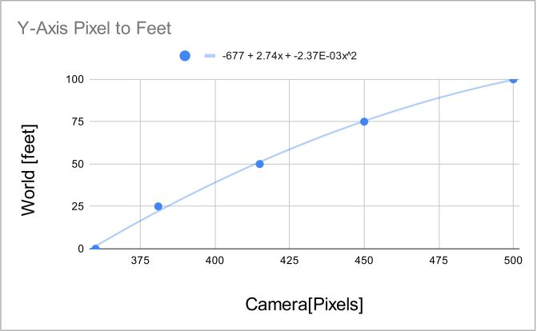

# __Vehicle Speed Traffic Monitoring__


---
<br />

## __INTRODUCTION__
Our project is to imlement Vehicle Speed Monitoring using Object Detection and Object Tracking. By taking advantage of image processing so that we are able to isolate the objects we want to track and update its current location in real-time. We would be able to calculate each of the vehicles speed using those prior information. Our goal is to monitor the speed of each vehicle and capture the vehicles which are over the speed limit.

## __HOW TO RUN__
1. Install __*Git*__
2. Clone the repository https://github.com/ErvinPicardal19/vehicle_tracking.git
```bash
git clone https://github.com/ErvinPicardal19/vehicle_tracking.git
```
3. Make a folder called "speeding_vehicles"
4. Run main.py
```bash
python main.py
```
 

## __3 STAGE PROCESS__
>1. ### Object Detection
>1. ### Object Tracking
>1. ### Calculate Speed
> ##### _P.S. For better Object Detection using Deep Neural Network would be better_
<br />

---

## __Object Detection__
> #### For object detection we used **_Background Subtraction, Image Processing,_ and _Image Segmentation_**
<br />


## _Background Subtraction_
```python
    _,frame1 = vid.read()
    roi = frame1[360:,:,:]
    grayscaled1 = cv2.cvtColor(roi, cv2.COLOR_BGR2GRAY)
    grayscaled1[grayscaled1<0] = 0
    grayscaled1[grayscaled1>255] = 255

    cv2.imshow("First Frame", frame1)

    vid.grab()

    _,frame2 = vid.read()
    roi = frame2[360:,:,:]
    grayscaled2 = cv2.cvtColor(roi, cv2.COLOR_BGR2GRAY)
    grayscaled2[grayscaled2<0] = 0
    grayscaled2[grayscaled2>255] = 255


    difference = np.int16(grayscaled2)-np.int16(grayscaled1)

    difference[difference<0] = 0
    difference[difference>255] = 255

    difference[difference<50] = 0
    difference[difference>=50] = 255

    difference = np.uint8(difference)

    cv2.imshow("Difference",difference)
```
 For background subtraction we subtract the current grayscaled frame to the previous grayscaled frame. Doing that we will get the new position of the current object. If any pixel of the previous frame did not change on the current frame then the pixel value would be 0. If an object moved then the difference between the current and the previous will result for only the object that moved be shown on the frame.


#### Original Frame

#### After BG Subtraction


<br />

## _Image Processing_
> Now for image processing we want to make our objects to be whole without any gaps. We can accomplish this by using _Morphological Operations_ to transform our frame matrix

```python
    # Image Processing

    mask = np.ones((5,5), np.uint8)
    
    dilate = cv2.morphologyEx(difference, cv2.MORPH_DILATE, mask, iterations=5)
    close = cv2.morphologyEx(dilate, cv2.MORPH_CLOSE, mask, iterations=5)
    open = cv2.morphologyEx(close, cv2.MORPH_OPEN, mask, iterations=5)
```

|                        Original                         |                       Dilate                       |                       Close                        |                      Open                      |
| :-----------------------------------------------------: | :------------------------------------------------: | :------------------------------------------------: | :--------------------------------------------: |
|  |  |  |  |

### After Image Processing


<br />

## _Image Segmentation_
> Now we want to be able to indentify our objects individually we can use image segmentation for this process. OpenCV already has a built-in method for this which is _connectedComponents_.

```python
(numLabels, labels, stats, centroids) = cv2.connectedComponentsWithStats(close, 4, cv2.CV_32S)
```


As you can see _connectedComponents_ will label our objects accordingly. We can utilize this to differentiate each objects to get their coordinates respectivley on the frame. 

<br />

---

## __Object Tracking__
> Our goal in object tracking is to be able to keep track and update the current location of each objects.

```python
    # [[x, y, w, h, cX, cY, carID, speed, check_speed]]
    car_tracking = np.array([[]])
```
First is we need an array which will hold the objects that are currently in the frame. Our array will be called car_tracking and the format of the data is shown on above.

```python
# Append and Update Trackers
    i = 1
    while(i < numLabels):

        x = stats[i, cv2.CC_STAT_LEFT]
        y = stats[i, cv2.CC_STAT_TOP]
        w = stats[i, cv2.CC_STAT_WIDTH]
        h = stats[i, cv2.CC_STAT_HEIGHT]
        area = stats[i, cv2.CC_STAT_AREA]
        (cX, cY) = centroids[i]

        new_tracker = np.array([[x,y,w,h,cX,cY,carID,0, False]])

        # if(w <= 160 and w >= 50 and h <= 160 and h >= 70):
        matchCarID = None

        if(car_tracking.size != 0):  
            for car in car_tracking:
                prev_x = car[0]
                prev_y = car[1]
                prev_w = car[2]
                prev_h = car[3]
                prev_cX = car[4]
                prev_cY = car[5]
                
                if((prev_x <= cX <= (prev_x+prev_w)) and (prev_y <= cY <= (prev_y+prev_h)) and (x <= prev_cX <= (x + w)) and (y <= prev_cY <= (y + h))):
                    print("Updating Trackers...")
                    matchCarID = i

                    if(car[8] != True):
                        speed = calc_speed(new_tracker[0], car)
                        car[7] = speed
                        car[8] = True

                    car[0] = x
                    car[1] = y
                    car[2] = w
                    car[3] = h
                    car[4] = cX
                    car[5] = cY
            
            if(matchCarID == None):
                print("Appending new Tracker... [ID: ", carID,"]")
                car_tracking = np.vstack((car_tracking, new_tracker))
                carID += 1
                
        else:
            print("Appending new Tracker... [ID: ", carID,"]")
            car_tracking = np.array(new_tracker)
            carID += 1


        i+=1
```
Now we will iterate through all the labeled objects on the frame using a while loop. During this loop we will check if the current object is already stored in the array. If not we will append a new tracker which hold the information regarding the position of the new object. If the object is already in the array we will just update the previous data of the array with the new updated position. 

```python
    i=0
        # Update new points
        if(car_tracking.size != 0):
            
            # Delete Unwanted Points
            while(i < car_tracking.shape[0]):
                if(car_tracking[i][5]+360 > 500):
                    print("Deleting Tracker... [ID: ", car_tracking[i][6], "]")
                    car_tracking = np.delete(car_tracking, i, 0)
                i+=1

            # Update Points
            for car in car_tracking:
                curr_x = car[0]
                curr_y = car[1]
                curr_w = car[2]
                curr_h = car[3]
                curr_cX = car[4]
                curr_cY = car[5]
                curr_car_id = car[6]
                speed = car[7]
                
                if(speed > 0):
                    cv2.rectangle(frame2, (int(curr_x),int(curr_y+360)),(int(curr_x+curr_w),int(curr_y+360+curr_h)), (0,255,0), 1)
                    cv2.circle(frame2, (int(curr_cX),int(curr_cY+360)), 3, (0,0,255),-1)
                    cv2.putText(frame2, Text.Text(int(speed)) + " kph", (int(curr_cX),int(curr_cY+360)), cv2.QT_FONT_NORMAL, 0.5, (0,255,0), 1)

                    if(speed > 80 and (curr_cY+360) <= 400):
                        print("CAR_ID: ", carID, "has exceeded the limit!!!!!!!")
                        # path = "C:/Users\ERVIN\Desktop/vehicle_Speed/vehicle_tracking/speeding_cars"
                        sc = frame2[int(curr_y+360) : int(curr_y+360+curr_h), int(curr_x) : int(curr_x+curr_w), :]
                        # cv2.imshow("Speeding", sc)
                        
                        cv2.imwrite(os.path.join(path,"CarID_" + str(curr_car_id) + ".png"), sc)
```

Then we will implement another loop which will loop through the entire array. For each element we will then plot the location of that objects using _cv2.circle()_ and _cv2.rectangle()_ so that we can see which object are we tracking in the frame. If there is a vehicle that exceeded the indicated speed limit _(80 kph)_ we will save a screenshot of that vehicle and save it in a file called speeding_vehicles

<br />

## _Speeding Vehicles_


<br />

---
## Speed Calculation
> For speed calculation it is quite computational. Which utilizes assumtions regarding the measurement of the road. To be able to get the right measurement of the road on a tilted/angled camera we need to use Linear Regression or Polynomial Regression

```python
    def calc_speed(curr_Pos, last_pos):
        curr_x = curr_Pos[4]
        prev_x = last_pos[4]
        curr_y = curr_Pos[5]+360
        prev_y = last_pos[5]+360

        # Pixels per 12 Feet
        pixel_per_12feet_curr_y= -1.82 + 0.146*curr_y + 0.000376*(curr_y**2)
        pixel_per_12feet_prev_y=-1.82 + 0.146*prev_y + 0.000376*(prev_y**2)

        # y-axis Pixel to feet
        curr_y= (-676.8992) + (2.7365*curr_y) + (-0.00237*(curr_y**2))
        prev_y= (-676.8992) + (2.7365*prev_y) + (-0.00237*(prev_y**2))
        
        # x-axis Pixel to feet
        curr_x = curr_x * (12 / pixel_per_12feet_curr_y)
        prev_x = prev_x * (12 / pixel_per_12feet_prev_y)
        
        # Compute distance travel and convert to kilometer
        distance = np.sqrt(((curr_x - prev_x)**2) + ((curr_y-prev_y)**2)) * 0.0003048
        # Convert to km/s to km/h
        kph = distance / (2/30) * 3600

        print("Distance: ", kph)
        curr_Pos[8] = True
        return kph
```
For the Speed Computation first is we need to map the pixel of the frame according to the real world measurement.

Accoring to documentation online regarding highways road dash lines the white line have a length of 10 feet while the distance between each dash lines is 30 feet. For the horizontal measurement there is 12 feet of width distance seprating the road lane. We used this assumptions for our computation but for more accurate calculation it is adviced to personally measure the distance of the roads. 


<br />

## Linear/Polynomial Regression





For us to be able to calculate the location of the vehicles in the real world we need to get the trendline of the real world measurement and map it accordingly to the pixel localation in the frame. After that we can use Linear/Polynomial Regression to get the trendline so that we would be able map new points in the frame into its respective Real World location. 

Now that we have the current and previous location of the object in the real world in feet we just need to convert it to kilometer. Then to get the distance between the location of the previous and the current location we can use pythogorean

> Pythogorean Theorem r<sup>2</sup> = x<sup>2</sup> + y<sup>2</sup>

### __(Distance[km])<sup>2</sup> = ( Current X-axis - Prev. X-axis)<sup>2</sup> + ( Current Y-axis - Prev. Y-axis)<sup>2</sup>__

### __Velocity[km/h] = Distance[km] / ((2/30) * 3600)__

<br />

Using the pythogorean formula we now have the distance traveled. The last thing we need now is the time it took for that travelled distance. Because we are using a video for our project we can use the framerate of the video which is 30 fps. We need to convert it to 2 fps by doing 2 divided by 30 this will give us the time it took after two frames as we are using two frames at the same time for our background subtraction. All we need to do now is divide the distance in kilometer to (2/30) to get kilometer per seconds. Then we need to convert kilometer per second(km/s) to kilometer per hour(km/h)

<br />
<br />
<br />
<br />

END.
